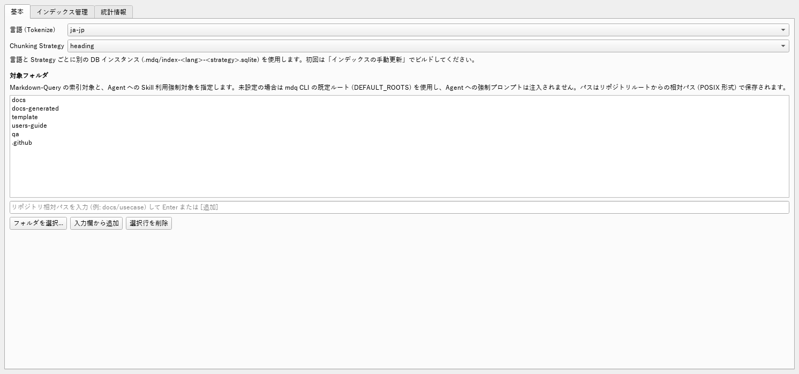
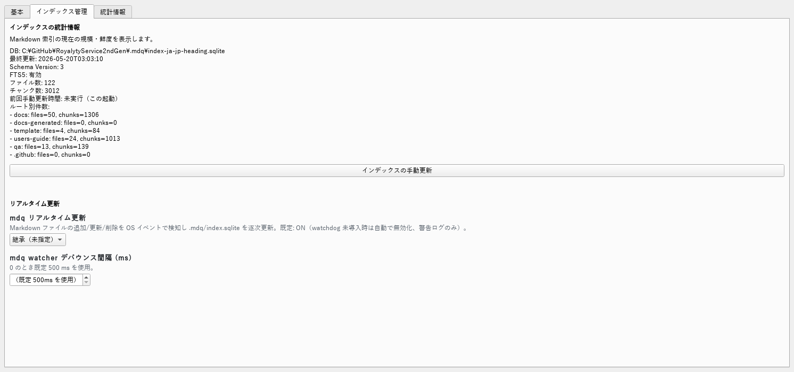
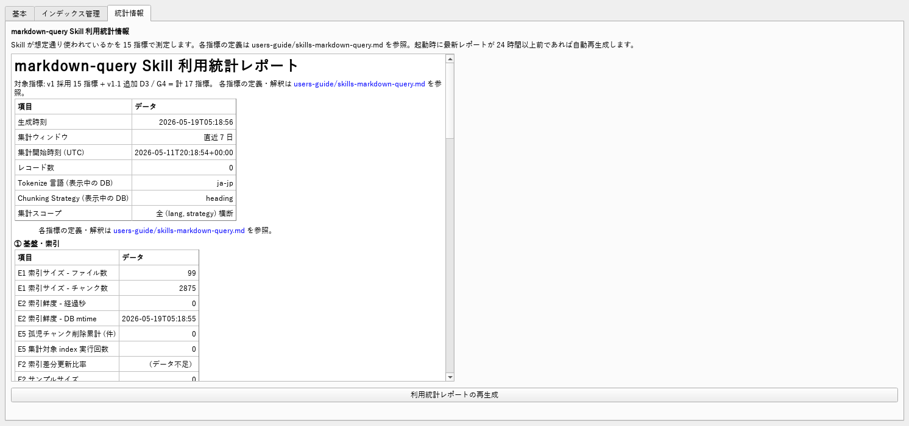

# 使い方 — `markdown-query` 独立 GUI

セットアップが終わったら（[SETUP.md](./SETUP.md) 参照）、ランチャーで GUI を
起動して 3 つのタブを操作します。

## 起動

```powershell
# Windows
tools\skills\markdown_query\launch-gui.cmd                # CWD をリポジトリとして扱う
tools\skills\markdown_query\launch-gui.cmd C:\path\to\repo  # 明示指定
```

```bash
# Linux / macOS
bash tools/skills/markdown_query/launch-gui.sh
bash tools/skills/markdown_query/launch-gui.sh /path/to/repo
```

## タブ 1: 基本



- **言語 (Tokenize)**: `ja-jp` または `en-us` を選択。
  FTS5 トークナイザと per-language DB インスタンスを切替えます。
- **Chunking Strategy**: `heading` / `heading_recursive` / `fixed_window`。
  選択ごとに DB は `.mdq/index-<lang>-<strategy>.sqlite` に分離されます。
  - 検索時に `--strategy auto` を使うと Skill 側ルータがクエリから最適を選択します。
- **Overlap (Paragraphs)**: `heading_recursive` 戦略専用。サブチャンク間で重ねる段落数。
  既定 `1`、`0` で無効化。他の Strategy では無視されます。
- **対象フォルダ**: 索引対象 + Agent への Skill 利用強制対象を指定。
  リポジトリ相対 POSIX パスで保存されます。未指定時は `mdq` CLI の
  `mdq.toml` / `.mdq/config.toml` の `[index].roots`（なければ最小デフォルト）が使われます。

## タブ 2: インデックス管理



- **インデックスの統計情報**: DB パス・最終更新・FTS5 状態・件数。
- **インデックスの手動更新**: ボタン押下で即座にビルド/差分更新。
- **リアルタイム更新**: `watchdog` 利用時に Markdown 変更を即時反映。
  デバウンス間隔は 0 で既定 500ms。

## タブ 3: 統計情報



- **markdown-query Skill 利用統計情報**: 19 指標で Skill 利用度を可視化（H1/H2 で auto routing / parent 展開を含む）。
- 起動時、最新レポートが 24 時間以上前なら自動再生成。
- 手動再生成ボタンあり。

レポートは
`tools/skills/markdown_query/usage-report/YYYY-MM-DD.{json,md}` および
`latest.{json,md}` に保存されます。

## 内部で何が起きているか

1. ランチャーが `vendor/` を `sys.path` に追加し `mdq` 同梱版を解決。
2. `python -m tools.skills.markdown_query.gui` でエントリ。
3. [`gui/standalone_window.py`](./gui/standalone_window.py) が
   [`gui/settings_section.py`](./gui/settings_section.py) の
   `MdqIndexSection` を `QMainWindow` 中央に配置して表示。
4. 設定保存は [`gui/settings_store.py`](./gui/settings_store.py) が担当
   （HVE ソースツリー内であれば `hve/.settings.txt` を共有、それ以外は
   `<repo>/.mdq-gui-settings.txt` に独立保存）。
